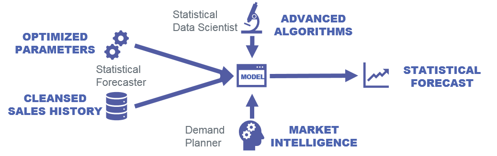

```{r, echo=FALSE, warning=FALSE, message=FALSE}
require(dplyr)
library(magrittr)
library(fcsttools)
```


# Outline

- Our team
- Digitalization in Supply Chain
- Forecasting pipelines
  - State-of-art
  - How do we perform demand forecasting at Sanofi?
  - Business intelligence enrichment
  - Key Performance Indicators (KPI's)
  - Continuous improvement: Algorithm study
  - Kinaxis
- The future

---
# Our team


---
class: center, middle, inverse

# Digitalization in Supply Chain


---
# Forecasting pipelines

## State-of-art

- Cross model forecasting average almost always outperform single model estimates
- Dampened trends perform better at long horizons 
- Forecasting competition findings
  - Aim to improve forecasting performance
  - 12 out of 17 best performers are combination of statistical approaches
  - At the M4 the winner was an *hybrid* (statistical + ML) approach
  - Pure ML methods performed poorly

---
## How do we perform demand forecasting at Sanofi?

```{r}

```

---

.pl[

```{r tidy=FALSE}
data("rainfall", package = "fcsttools")
```

]


---
## How do we perform demand forecasting at Sanofi?
### Cross-validation


.pl[
```{r tidy=FALSE, eval=FALSE}
(cv <- rainfall %>%
   filter(country=="Costa Rica") %>% 
   mutate(month=lubridate::month(date, label=TRUE)
          , time_index=1:n()) %>% 
   dplyr::select(-country, -date) %>%
   cvts(data = ., cv_size = 10
       , lead_time = 3
{{     , keep_prev=TRUE))}}
```

```{r, echo=F}
(cv <- rainfall_cr %>% 
  cvts(data = ., cv_size = 10
       , lead_time = 3
     , keep_prev=TRUE))
```
]


--

.pr[
```{r}
cv$train[[1]] %>% tail(5)
cv$test[[1]]
```
]


---
```{r eval=FALSE}
rainfall %>% 
  group_nest(country) %>% 
  filter(country %in% sample(country, size = 5)) %>% 
{{ mutate(cv=map(data, ~cvts(data = .x, cv_size = 6, lead_time = 3, keep_prev=TRUE)))}}
```


```{r echo=FALSE}
(fit <- rainfall %>%
  group_nest(country) %>% 
  filter(country %in% sample(country, size = 5)) %>%
  mutate(cv=map(data, ~cvts(data = .x, cv_size = 6, lead_time = 3, keep_prev=TRUE))))
```


---

```{r eval=FALSE}
rainfall %>% 
  group_nest(country) %>% 
  filter(country %in% sample(country, size = 5)) %>%
  mutate(cv=map(data, ~cvts(data = .x, cv_size = 6, lead_time = 3, keep_prev=TRUE))) %>% 
{{ unnest(cv)}}
```

```{r echo=F}
fit %<>% 
  unnest(cv)
```

---

```{r}
fit %>% 
  mutate(fit=)
```


---

.pr.imgmiddle[
```{r echo=FALSE, fig.align='center', out.width="200%"}
knitr::include_graphics("https://media1.tenor.com/images/42983a95657f874f62cfc1f1152da484/tenor.gif?itemid=8718500")
```

]


---

# Thanks!

